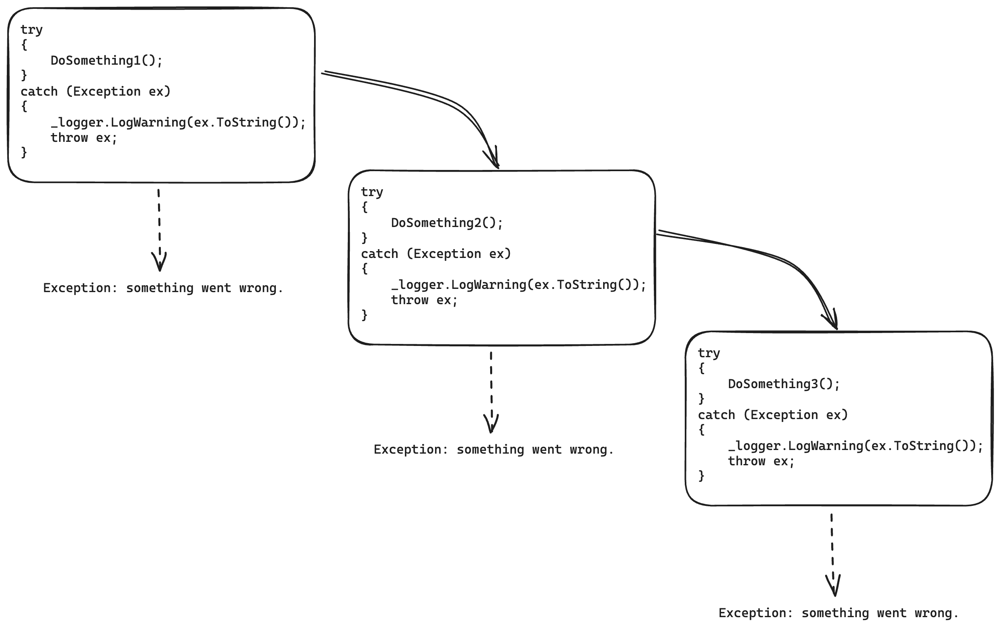
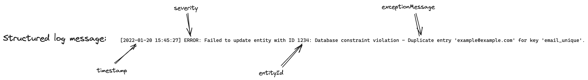
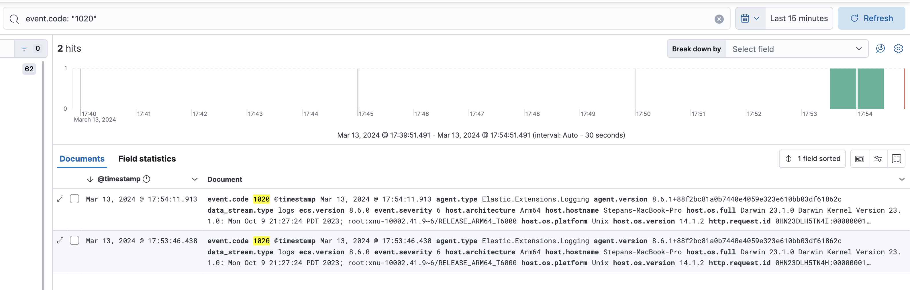

# Logging in .NET

---

## Введение

Зачем логгировать?

--

- другим разработчикам, для понимания “а что же происходит в том сервисе”
- при тестировании для более корректного составления задачи (проще же когда приносят ссылку на лог, чем абстрактное “при нажатии кнопки оно ломается”)
- поддержке для разбора ошибки/инцидента

---

## Уровни логирования

--

Почему это важно?

- Если писать все логи (и важные, и какие то технические) как, например, `Information` , то разбираться потом в этой куче уже не захочется
- Отсутствие возможности адекватно фильтровать логи для записи в elasticsearch на проде

--

| Level       | Description                                                                         |
| ----------- | ----------------------------------------------------------------------------------- |
| Trace       | Наиболее низкий уровень логирования для отслеживания всех происходящих событий      |
| Debug       | Сообщения которые могут быть полезны для понимания поведения приложения             |
| Information | Основные сообщения                                                                  |
| Warning     | Ситуации, которые, в теории, не должны происходить, однако корректно обрабатываются |
| Error       | Некритичные ошибки, которые не были предусмотрены                                   |
| Critical    | Критические ошибки, при возникновении которых приложение не может продолжать работу |
| None        | Используется только в фильтрах для отключения логов                                 |

---

## Обработка ошибок

--

Обычный способ:

```csharp
try
{
    DoSomething();
}
catch (Exception ex)
{
    _logger.LogWarning(ex.ToString());
    throw ex;
}
```

--



--

А в чем проблема?

- Засорение методов по своей сути бесполезным кодом, который только ухудшает читаемость
- Потеря стактрейса при перепрокидывании исключения.
- Вызывая какой то метод, который кидает исключение можно ли угадать, не заглядывая в него, залогировал ли он его? В итоге можно получить в логах несколько записей об одном и том же исключении по сути

--

```csharp
public abstract class DomainException(string message, Exception? innerException = null)
    : Exception(message, innerException)
{
    public abstract string ERROR_CODE { get; }

    public virtual ProblemDetails GetProblemDetails() => new()
    {
        Title = ERROR_CODE,
        Detail = message,
        Status = (int)HttpStatusCode.UnprocessableEntity
    };
}
```

--

```csharp
public class NickTakenException(string nickName, Exception? innerException = null)
    : DomainException($"Nick {nickName} already taken", innerException)
{
    public override string ERROR_CODE => "NICKNAME_TAKEN";
}
```

--

```csharp
try
{
    await _petsRepository.Create(pet);
}
catch (UniqueConstraintException ex)
{
    throw new NickTakenException(pet.NickName, ex);
}
```

--

```csharp
public class ExceptionFilter(ILogger<ExceptionFilter> logger) : IEndpointFilter
{
    public async ValueTask<object?> InvokeAsync(
        EndpointFilterInvocationContext context,
        EndpointFilterDelegate next)
    {
        try
        {
            return await next(context);
        }
        catch (DomainException e)
        {
            logger.LogInformation(
                eventId: ApplicationEventId.UnprocessibleRequest,
                message: "Cannot process request due to domain exception: {exception}",
                e.Message);

            return TypedResults.Problem(e.GetProblemDetails());
        }
        catch (Exception e)
        {
            logger.LogError(
                eventId: ApplicationEventId.RequestFailed,
                exception: e,
                message: "Request failed"
            );

            throw;
        }
    }
}
```

--

<div class="mermaid">
    <pre>
        graph TD;
            Exception --> ApplicationException;
            ApplicationException --> DomainException;
            ApplicationException --> InternalException;
            DomainException --> UserNotFoundException;
            InternalException --> UnpredictedStateException;
    </pre>
</div>

---

## А что логировать?

- Исключения. Какие и как разобрались
- Доменные события (мутация данных, действия пользователя)
- Технические данные для возможного дебага (с `LogLevel.Debug` или `LogLevel.Trace`)

---

## Формат логов

--

Плоское логгирование:

```
[2022-01-20 15:45:27] ERROR: Failed to update entity with ID 1234:
Database constraint violation - Duplicate entry 'example@example.com'
for key 'email_unique'.
```

--

Поиск по логам:

```shell
$ cat test.log | grep 'ERROR' | grep 'ID 1234'
```

--

Не попадет в выборку:

```
[2022-01-20 15:45:20] ERROR: Failed to deserialize response for get entities with ID=1234
```

---

## Структурированное логгированние

--



--

```json
{
  "timestamp": "2022-01-20 15:45:27",
  "severity": "error",
  "messageTemplate": "Failed to update entity with ID {entityId}: {exceptionMessage}.",
  "messageDisplay": "Failed to update entity with ID 1234: Database constraint violation - Duplicate entry 'example@example.com' for key 'email_unique'.",
  "data": {
    "entityId": 1234,
    "exceptionMessage": "Database constraint violation - Duplicate entry 'example@example.com' for key 'email_unique'"
  }
}
```

--

Поиск в ecs:

```
severity: error and data.entityId: 1234
```

--

🙅‍♂️

```csharp
public async Task<Pet> CreatePet(Pet pet)
{
    _logger.LogInformation($"Creating pet with name {pet.NickName}");
    // or
    logger.LogInformation($"Pet: {JsonSerializer.Serialize(pet)}");

    // collapsed
}

```

--

Полнотекстовый поиск:

```
FullText: *some value*
```

--

👍

```csharp
_logger.LogInformation("Creating pet with name {NickName}", pet.NickName);
```

---

## EventId

--

```csharp
public static class ApplicationEventId
{
    public const int CreatePet = 1_000;
}
```

--

```csharp
public async Task<Pet> CreatePet(Pet pet)
{
    logger.LogInformation(
        eventId: ApplicationEventId.CreatePet,
        message: "Creating pet with nickname({nickName})",
        args: pet.NickName
    );

    ...
}
```

--



--

`{EventId.Name}({EventId.Id})`

---

## Интерфейсы логгирования

--

Стандартный способ:

```csharp
logger.LogInformation(
    eventId: ApplicationEventId.CreatePet,
    message: "Creating pet with nickname({nickName})",
    args: pet.NickName
);
```

--

Source-generated loggers.

--

<pre>
    <code data-trim data-noescape data-line-numbers style="font-size: 12px; max-height: 600px !important;">
public class CacheService<TKey, TValue>
    : IDisposable
    where TKey : IEquatable<TKey>
    where TValue : class
{
    private sealed record CacheWrapper(DateTime ExpiresAt, TValue Value);

    private readonly ConcurrentDictionary<TKey, CacheWrapper> _cache = new();
    private readonly TimeSpan _timeToLive = TimeSpan.FromMinutes(10);
    private readonly TimeSpan _purgingInterval = TimeSpan.FromSeconds(10);
    private readonly Timer _timer;

    public CacheService()
    {
        _timer = new Timer(_purgingInterval);
        _timer.Elapsed += PurgeExpired;
        
        _timer.Start();
    }

    private void PurgeExpired(object? sender, ElapsedEventArgs e)
    {
        if (_cache.IsEmpty)
            return;

        var expiredKeys = _cache
            .Where(kv => kv.Value.ExpiresAt < DateTime.UtcNow)
            .Select(kv => kv.Key)
            .ToArray();

        foreach (var key in expiredKeys)
        {
            _cache.Remove(key, out _);
        }
    }
    
    public Task<TValue?> Get(TKey key, Func<TKey, Task<TValue?>> retrieve)
        => _cache.GetValueOrDefault(key) switch
        {
            { } cachedValue when cachedValue.ExpiresAt > DateTime.UtcNow => Task.FromResult<TValue?>(cachedValue.Value),
            null => GetAndSet(key, retrieve),
            _ => GetAndSetIfExpired(key, retrieve),
        };

    private async Task<TValue?> GetAndSet(TKey key, Func<TKey, Task<TValue?>> retrieve)
    {
        var value = await retrieve(key);

        if (value is null)
            return null;

        _cache.TryAdd(key, new CacheWrapper(DateTime.UtcNow + _timeToLive, value));

        return value;
    }

    private Task<TValue?> GetAndSetIfExpired(TKey key, Func<TKey, Task<TValue?>> retrieve)
    {
        _cache.Remove(key, out _);

        return GetAndSet(key, retrieve);
    }

    public void Dispose() => _timer.Dispose();
}
    </code>
</pre>

--

```csharp
private async Task<TValue?> GetAndSet(TKey key, Func<TKey, Task<TValue?>> retrieve)
{
    var value = await retrieve(key);

    if (value is null)
        return null;

    _cache.TryAdd(key, new CacheWrapper(DateTime.UtcNow + _timeToLive, value));

    return value;
}
```

--

```csharp[ | 3-7, 13-17, 24-29]
private async Task<TValue?> GetAndSet(TKey key, Func<TKey, Task<TValue?>> retrieve)
{
    _logger.LogDebug(
        InternalEventId.CacheValueMissed,
        "Missed cache value for key {key}",
        key
    );

    var value = await retrieve(key);

    if (value is null)
    {
        _logger.LogDebug(
            InternalEventId.CacheRetrievedNullActualValue,
            "Cache retrieved null actual value for key {key}",
            key
        );

        return null;
    }

    _cache.TryAdd(key, new CacheWrapper(DateTime.UtcNow + _timeToLive, value));

    _logger.LogDebug(
        InternalEventId.CacheReturnedActualValue,
        "Cache returned actual value {value} for key {key}",
        value,
        key
    );

    return value;
}
```

--

Source-generated log:

```csharp
internal static partial class CacheServiceLogger
{
    [LoggerMessage(
        EventId = InternalEventId.CacheValueMissed,
        Level = LogLevel.Debug,
        Message = "Missed cache value for key {key}"
    )]
    internal static partial void LogCacheMiss(this ILogger logger, object key);
}
```

--

```csharp
partial class CacheServiceLogger
{
    [global::System.CodeDom.Compiler.GeneratedCodeAttribute("Microsoft.Extensions.Logging.Generators", "8.0.9.3103")]
    private static readonly global::System.Action<global::Microsoft.Extensions.Logging.ILogger, global::System.Object, global::System.Exception?> __LogCacheMissCallback =
        global::Microsoft.Extensions.Logging.LoggerMessage.Define<global::System.Object>(global::Microsoft.Extensions.Logging.LogLevel.Debug, new global::Microsoft.Extensions.Logging.EventId(2010, nameof(LogCacheMiss)), "Missed cache value for key {key}", new global::Microsoft.Extensions.Logging.LogDefineOptions() { SkipEnabledCheck = true });

    [global::System.CodeDom.Compiler.GeneratedCodeAttribute("Microsoft.Extensions.Logging.Generators", "8.0.9.3103")]
    internal static partial void LogCacheMiss(this global::Microsoft.Extensions.Logging.ILogger logger, global::System.Object key)
    {
        if (logger.IsEnabled(global::Microsoft.Extensions.Logging.LogLevel.Debug))
        {
            __LogCacheMissCallback(logger, key, null);
        }
    }
}
```

--

```csharp
private async Task<TValue?> GetAndSet(TKey key, Func<TKey, Task<TValue?>> retrieve)
{
    _logger.LogCacheMiss(key);

    var value = await retrieve(key);

    if (value is null)
    {
        _logger.LogCacheNullActualValue(key);
        return null;
    }

    _cache.TryAdd(key, new CacheWrapper(DateTime.UtcNow + _timeToLive, value));

    _logger.LogActualValue(value, key);

    return value;
}
```

--

Структурированное логгирование из Elastic.Extensions.Logging

--

```csharp
_logger.CreateEntry(LogLeve.Information, ApplicationEventId.CreatePet)
    .Message($"Creating pet with nickname({pet.NickName})")
    .Data(new { NickName = pet.NickName })
    .Write()
    ;
```

--

Как расширение

```csharp
public static void LogCreatePet(this ILogger<PetService> logger, string nickName) => _logger
    .CreateEntry(LogLeve.Information, ApplicationEventId.CreatePet)
    .Message($"Creating pet with nickname({nickName})")
    .Data(new { NickName = nickName })
    .Write()
    ;
```

---

## Performance

--

BenchmarkDotNet

| Method             | Mean           | Error       | StdDev      |
| ------------------ | -------------- | ----------- | ----------- |
| NoLog              | 0.0103 ns      | 0.0015 ns   | 0.0013 ns   |
| StandardLog        | 10,037.8848 ns | 199.7660 ns | 222.0394 ns |
| SourceGeneratedLog | 9,832.4832 ns  | 196.4297 ns | 557.2383 ns |
| SuppressLog        | 42.0594 ns     | 0.5636 ns   | 0.4706 ns   |

--

Crank

| Bench name | Requests  | Mean latency (ms) | Requests/sec |
| ---------- | --------- | ----------------- | ------------ |
| NoLog      | 2,873,553 | 1.33              | 191,056      |
| StdLog     | 133,919   | 28.69             | 9,079        |
| SourceGen  | 133,178   | 28.85             | 8,990        |
| DefinedLog | 133,342   | 28.81             | 9,010        |
| SupressLog | 2,837,691 | 1.35              | 188,341      |

--

Console vs file

| Method  | Mean         | Error       | StdDev      | Median       |
| ------- | ------------ | ----------- | ----------- | ------------ |
| Console | 232,008.7 ns | 3,605.41 ns | 3,372.50 ns | 231,885.4 ns |
| File    | 650.7 ns     | 23.81 ns    | 70.22 ns    | 619.7 ns     |

---

## Конфигурация

--

```csharp
builder.Logging.AddFilter<ConsoleLoggerProvider>("Default", LogLevel.Critical);
builder.Logging.AddFilter<Elastic.Extensions.Logging.Provider>("Default", LogLevel.Information);
builder.Logging.AddFilter<Elastic.Extensions.Logging.Provider>("Microsoft", LogLevel.Warning);
builder.Logging.AddFilter<Elastic.Extensions.Logging.Provider>("Jaeger", LogLevel.Warning);
```

--

```csharp
if (builder.Environment.IsProduction()) 
{
	builder.Logging.AddFilter<ConsoleLoggerProvider>("Default", LogLevel.Critical);
	builder.Logging.AddFilter<Elastic.Extensions.Logging.Provider>("Default", LogLevel.Information);
	builder.Logging.AddFilter<Elastic.Extensions.Logging.Provider>("Microsoft", LogLevel.Warning);
	builder.Logging.AddFilter<Elastic.Extensions.Logging.Provider>("Jaeger", LogLevel.Warning);
}
else
{
	builder.Logging.AddFilter<ConsoleLoggerProvider>("Default", LogLevel.Information);
	builder.Logging.AddFilter<Elastic.Extensions.Logging.Provider>("Default", LogLevel.Information);
	builder.Logging.AddFilter<Elastic.Extensions.Logging.Provider>("Microsoft", LogLevel.Information);
	builder.Logging.AddFilter<Elastic.Extensions.Logging.Provider>("Jaeger", LogLevel.Warning);
}
```

--

```json
{
    "Logging": {
        "Console": {
            "LogLevel": {
                "Default": "Critical"
            }
        },
        "Elastic": {
            "Default": "Information",
            "Microsoft": "Warning",
            "Jaeger": "Warning"
        }
    }
}
```

--

<div class="mermaid"><pre>
graph TD
    A[Logging]
    B[Console]
    C[LogLevel]
    D[Default]
    E[Elastic]
    F[Default]
    G[Microsoft]
    H[Jaeger]

    A --> B
    A --> E
    B --> C
    C --> D
    E --> F
    F --> FValue[Value = Information]
    E --> G
    G --> GValue[Value = Warning]
    E --> H
    H --> HValue[Value = Warning]
    D --> DValue[Value = Critical]
</pre></div>

---

## Заключение

--

- Пишите логи, они помогут и вам, и другим;
- Пишите их осознанно, с понятными сообщениями и контекстом, проставляйте категорию и выбирайте правильный уровень;
- Не используйте строковую интерполяцию и, тем более, JsonSerializer, пишите их структурированно;
- Помимо того чтобы проставлять уровни для логов, настраивайте фильтрацию ненужных логов для контуров;
- Обрабатывайте корректно ошибки, не лепите бесполезные try-catch`и.